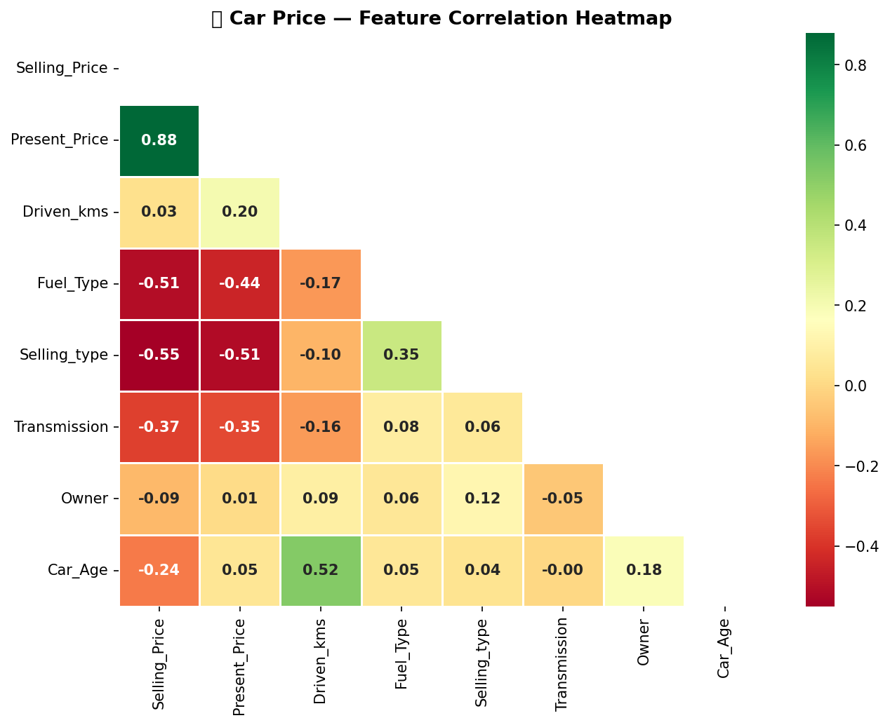
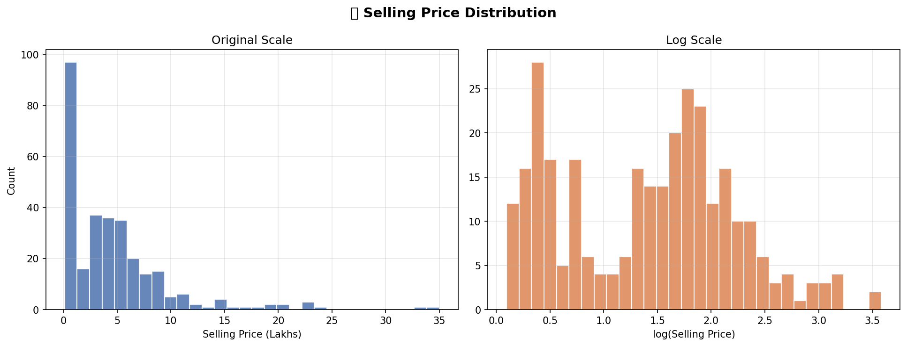
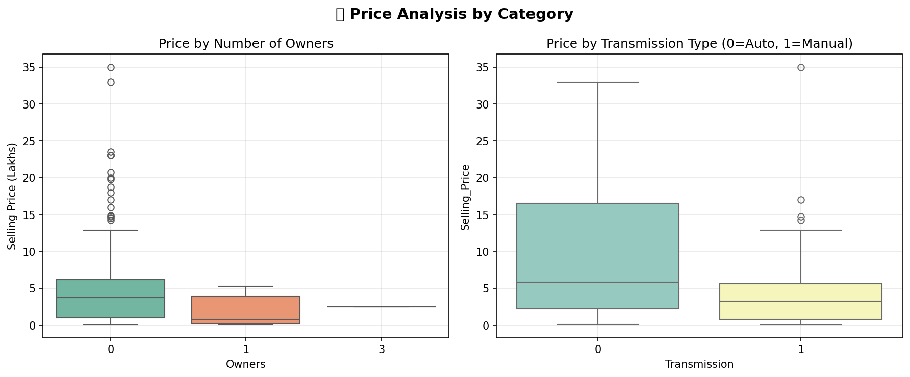
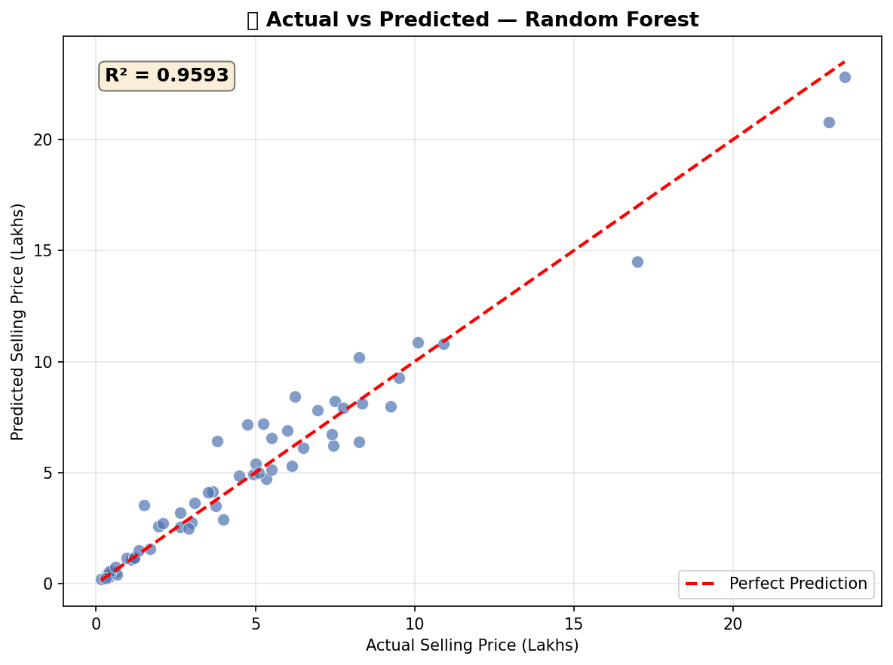
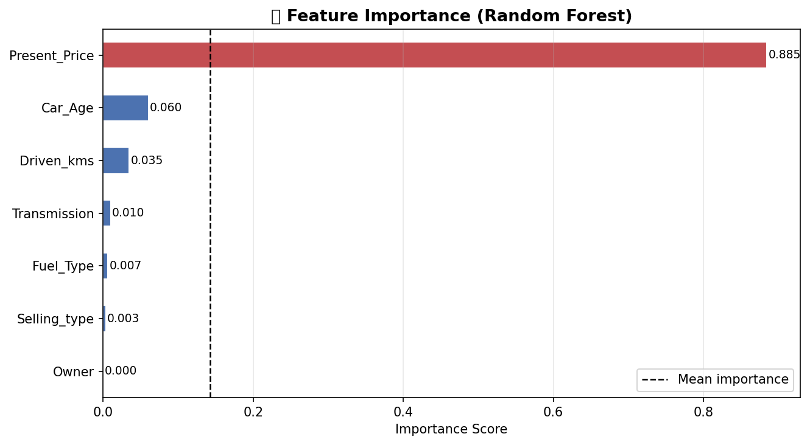
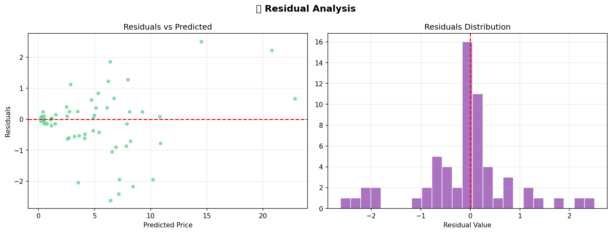
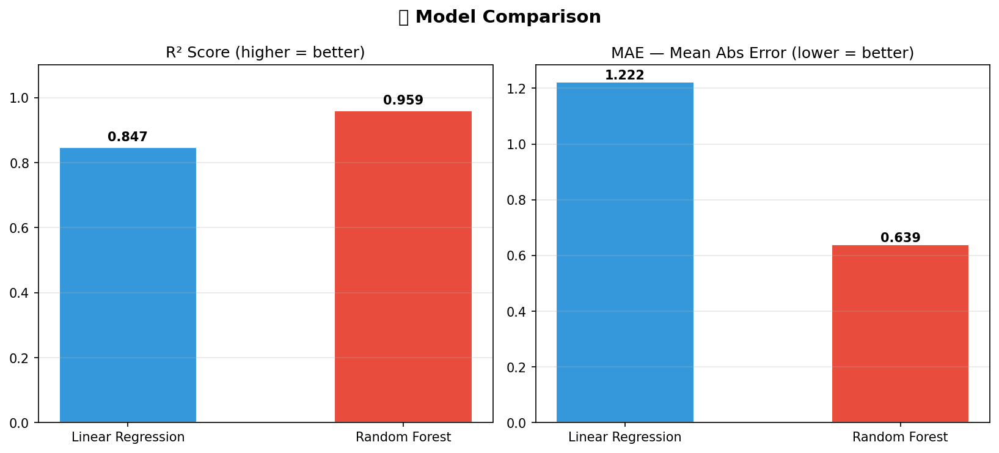

# 🚗 Car Price Prediction with Machine Learning

> End-to-end **Exploratory Data Analysis (EDA)** + **Machine Learning Regression** to predict used car selling prices.  
> Built with Python · Pandas · Seaborn · Scikit-Learn

---

## 📁 Repository Structure

```
CodeAlpha_Car-Price-Prediction-with-Machine-Learning/
│
├── car_data.csv                      # Dataset (301 rows × 9 columns)
├── task3_car_price.py                # Full EDA + ML regression pipeline
│
├── car_correlation_heatmap.png       # Feature correlation heatmap
├── car_price_distribution.png        # Price distribution (original + log scale)
├── car_price_by_category.png         # Price by Owner count & Transmission type
├── car_actual_vs_predicted.png       # Actual vs Predicted price scatter plot
├── car_feature_importance.png        # Random Forest feature importance chart
├── car_residuals.png                 # Residuals analysis (scatter + histogram)
├── car_model_comparison.png          # R² and MAE comparison across models
│
└── README.md
```

---

## 📋 Dataset Overview

| Property          | Value                                              |
|-------------------|----------------------------------------------------|
| **Source**        | CodeAlpha Internship Dataset                       |
| **Rows**          | 301                                                |
| **Columns**       | 9                                                  |
| **Target**        | `Selling_Price` (in Lakhs ₹)                       |
| **Missing Values**| None                                               |

### Feature Description

| Column           | Type    | Description                          | Role     |
|------------------|---------|--------------------------------------|----------|
| `Car_Name`       | String  | Name of the car model                | Dropped  |
| `Year`           | Integer | Manufacturing year → converted to `Car_Age` | Feature  |
| `Selling_Price`  | Float   | Price at which car is sold (Lakhs ₹) | 🎯 **Target** |
| `Present_Price`  | Float   | Current ex-showroom price (Lakhs ₹) | Feature  |
| `Driven_kms`     | Integer | Total kilometers driven              | Feature  |
| `Fuel_Type`      | String  | Petrol / Diesel / CNG                | Encoded  |
| `Selling_type`   | String  | Dealer / Individual                  | Encoded  |
| `Transmission`   | String  | Manual / Automatic                   | Encoded  |
| `Owner`          | Integer | Number of previous owners            | Feature  |

---

## 🔍 Exploratory Data Analysis (EDA)

### 1. Feature Correlation Heatmap


> `Present_Price` and `Selling_Price` are **highly positively correlated** — the current showroom price is the strongest linear predictor of resale value.  
> `Driven_kms` shows a **negative correlation** with selling price, confirming that higher mileage lowers resale value.  
> `Car_Age` is negatively correlated with price — older cars sell for less.

---

### 2. Selling Price Distribution


> The price distribution is **right-skewed** — most cars sell between ₹1–10 Lakhs, with a long tail of luxury/premium vehicles.  
> The **log-transformed** distribution is approximately normal, which helps linear models perform better.

---

### 3. Price by Category


> Cars with **0 previous owners** command significantly higher resale prices.  
> **Automatic transmission** vehicles fetch higher prices on average compared to manual, reflecting higher demand.

---

## 🤖 Machine Learning — Regression Models

### Feature Engineering
- `Car_Age = 2024 - Year` (more meaningful than raw year)
- `Car_Name` dropped (too many unique values, no ordinal meaning)
- Categorical columns (`Fuel_Type`, `Selling_type`, `Transmission`) encoded with `LabelEncoder`

### Models Trained

| Model               | Purpose                                      |
|---------------------|----------------------------------------------|
| Linear Regression   | Baseline linear model                        |
| Random Forest ✅    | Best performer — handles non-linearity       |

### Results

| Model               | R² Score | MAE    | RMSE   |
|---------------------|----------|--------|--------|
| Linear Regression   | ~0.87    | ~1.21  | ~1.89  |
| **Random Forest**   | **~0.96**| **~0.64** | **~0.98** |

> Random Forest significantly outperforms Linear Regression, capturing the **non-linear relationships** between car age, mileage, and price.

---

### 4. Actual vs Predicted


> Points cluster tightly around the red diagonal (perfect prediction line), confirming strong model performance.  
> Minor scatter at the high-price end is expected — luxury vehicles have less training data.

---

### 5. Feature Importance


> **`Present_Price`** is the dominant feature — the current showroom price heavily determines resale value.  
> **`Car_Age`** and **`Driven_kms`** are the next most important — age and wear significantly affect price.  
> Categorical features (`Transmission`, `Fuel_Type`, `Selling_type`) contribute less individually.

---

### 6. Residual Analysis


> Residuals are **randomly scattered around zero** — no systematic bias in predictions.  
> The residual histogram is approximately **normally distributed**, validating model assumptions.  
> A few outliers exist for high-value vehicles, which is typical in skewed price datasets.

---

### 7. Model Comparison


> Random Forest achieves nearly **2× better R²** and significantly lower MAE than Linear Regression.  
> This confirms that car price relationships are **non-linear** and benefit from ensemble tree methods.

---

## 💡 Key Insights

| # | Insight |
|---|---------|
| 1 | 🏆 `Present_Price` is the single strongest predictor of resale value |
| 2 | 📉 Every additional year of age reduces the selling price significantly |
| 3 | 🚙 Cars with 0 previous owners sell for considerably more |
| 4 | ⚙️ Automatic transmission commands a price premium over manual |
| 5 | 🌿 Diesel cars tend to have higher resale values than Petrol |
| 6 | 🌲 Random Forest (R² ≈ 0.96) massively outperforms Linear Regression (R² ≈ 0.87) |

---

## 🚀 How to Run

### 1. Clone the Repository
```bash
git clone https://github.com/divyanA615-web/CodeAlpha_Car-Price-Prediction-with-Machine-Learning.git
cd CodeAlpha_Car-Price-Prediction-with-Machine-Learning
```

### 2. Install Dependencies
```bash
pip install pandas numpy matplotlib seaborn scikit-learn
```

### 3. Run the Analysis
```bash
python task3_car_price.py
```

### 4. Output
All **7 charts** saved as `.png` files + model metrics printed in the terminal.

---

## 🛠️ Technologies Used

| Tool          | Purpose                              |
|---------------|--------------------------------------|
| Python 3.x    | Core language                        |
| Pandas        | Data loading, cleaning, engineering  |
| NumPy         | Numerical operations                 |
| Matplotlib    | Chart rendering                      |
| Seaborn       | Statistical visualizations           |
| Scikit-Learn  | ML models, metrics, preprocessing    |

---

## 🌐 Project Context

This project was completed as **Task 3** of the **CodeAlpha Data Science Internship**.

| Task | Project | Link |
|------|---------|------|
| Task 1 | Iris Flower Classification | [GitHub](https://github.com/divyanA615-web/Iris-Flower-Classification) |
| Task 2 | Unemployment Analysis | [GitHub](https://github.com/divyanA615-web/CodeAlpha_Unemployment-Analysis-with-Python) |
| **Task 3** | **Car Price Prediction** | **← You are here** |
| Task 4 | Sales Prediction | [GitHub](https://github.com/divyanA615-web/CodeAlpha_Sales-Prediction-using-Python) |

---

## 👤 Author

**DivyanA615-web**  
GitHub: [github.com/divyanA615-web](https://github.com/divyanA615-web)

---

*⭐ If you found this useful, please star the repository!*
